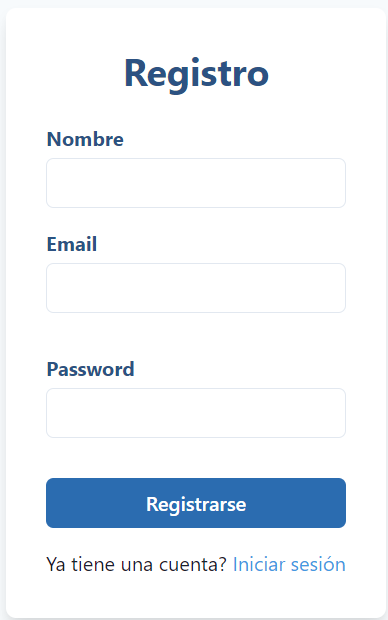
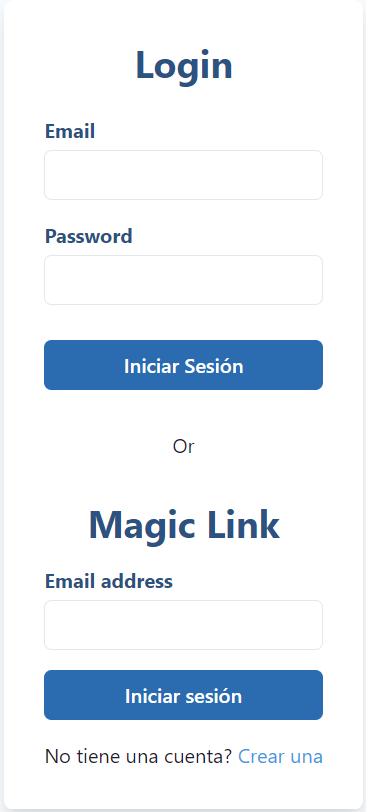
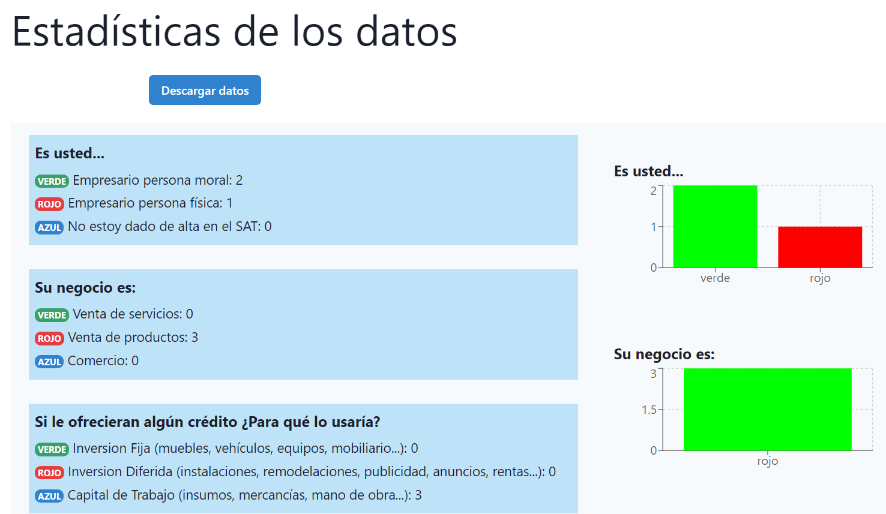
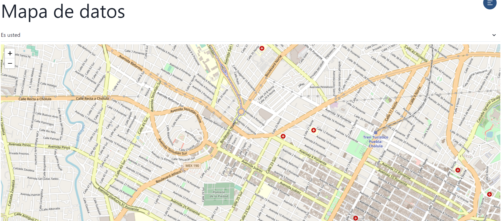

# Admin-encuesta

App frontend para llevar a cabo la administración de los datos recabados por las encuentas realizadas a los usuarios los cuales se muestran a modo de gráficos y por zonas por medio de un mapa.

## Tecnologías aplicadas

Las siguientes tecnologías fueron empleadas para construir la aplicación:

* React
* Javascript
* HTML
* JSON
* Supabase

## Requisitos previos

1. Instalar NodeJS y npm: https://nodejs.org/es/download
2. Instalar yarn: https://nodejs.org/es/download

## Despliegue

Con el fin de desplegar la aplicación de manera local es necesario seguir los siguientes pasos:

### 1. Configuración en Supabase

* Guiarse en la siguiente documentación de Supabase: [Supabase documentation](supabase.md).

### 2. Despliegue del proyecto en local

1. Clonar este repo
 ```sh
git clone https://github.com/JosafatJimenezB/admin-encuesta.git
```
2. En la carpeta raíz del proyecto ejecutar:
```sh
npm install
```
3. Crear un archivo .env con las siguientes variables de entorno cuyo valor es obtenido de acuerdo a la [documentación de Supabase](supabase.md)

* Ejemplo:
```sh
VITE_PUBLIC_SUPABASE_URL={{url}}}

VITE_PUBLIC_ANON_KEY={{anon-key}}

VITE_PUBLIC_DATA_ALL={{public-data}}
```
4. Desplegar el proyecto con el siguiente comando:
 ```sh
npm run dev
```

## Login

* Crearse una cuenta



* Hay 2 formas de iniciar sesión: por usuario y contraseña o por medio de "Magic clic" en el cual nos llegara un enlace a nuestro correo electrónico con el enlace para iniciar sesión:



## Administración de la app

* Visualización de datos por estadísticas y gráficos:



* Visualización de estadísticas por mapa:


